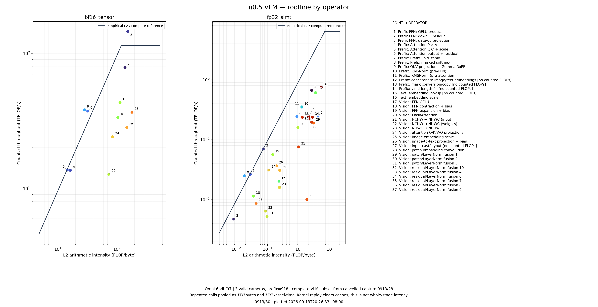
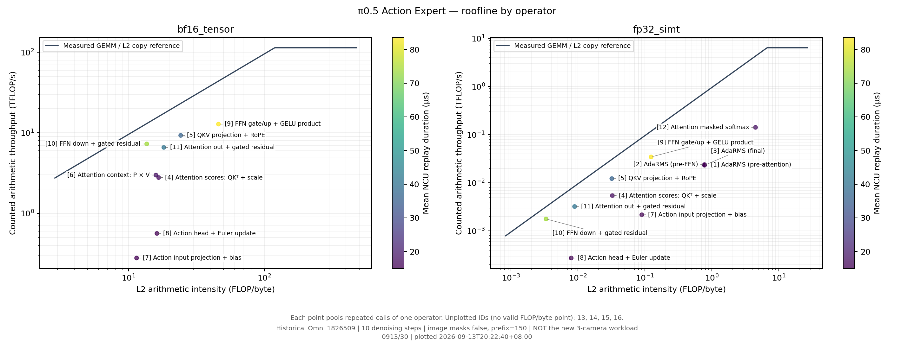

# vla-vllm-profiling

在 NVIDIA Thor 上部署 vLLM-Omni π0.5，采集 VLM 与 Action Expert 的逐 kernel 和整体
timing、FLOP 与内存层级流量，并绘制完整 VLA 的 GPU Roofline 图。

**当前结果（2026-09-13）：按用户要求停止 NCU，使用已有 VLM 数据与历史 Action Expert breakdown 分别绘图，见 [0913/30](results/processed/0913/30/README.md)。**

- VLM：新源码 `6bdbf97`、三路有效图像、前缀 918；从中断报告恢复完整的 **1,018 次调用 / 37 个算子组**。
- Action Expert：复用旧源码 `1826509` 的完整 **1,654 次调用 / 16 个算子组**，历史图像被 mask、前缀 150。两套数据分别展示，不相加为一次 VLA。
- 图内标注算子与 `0913/30` 绘图时间，附逐调用图、PDF、CSV 和覆盖审计。参考线来自旧微基准，不是本轮已验证的硬件上限。
- `0913/28` 和 `0913/29` 已取消，无自动重试；本次只解析已有报告，没有新模型运行或 NCU 采集。





新版本无 NCU 基线见 [0913/27](results/processed/0913/27/README.md)。VLM / Action Expert / VLA GPU 图的 p50 分别为 **69.05 / 41.95 / 111.01 ms**，原始完整 pipeline 为 **113.41 ms**。基线分段及捕获后的输出相对原始 pipeline 最大差均为 0。整体 roofline 所需的整图流量尚未采集。
[模型文件](docs/model_assets.md)、[计数器校验](results/processed/compute_counter_validation/)、
[历史结果与限制](results/processed/thor_pi05_20260913/)。

整模型数值调查已在 L20 完成，见 [0913/15 完整输出对照](results/processed/0913/15/README.md)
和 [错误定位](results/processed/0913/15/findings.md)。三路有效图像下，最终动作相对 RMSE
从 166.084% 降至修正 RoPE 后的 3.113%，再修正相机图特征覆盖后为 1.007%。
修正已落实到新框架源码，L20 的源码回归相对 RMSE 为 **1.0047%**，见
[0913/21](results/processed/0913/21/README.md)。这些是固定合成输入的完整 pipeline 实测，
不是 Thor 的性能结果，也尚未达到完全数值对齐。
后续已将修正落实到源码并推送 `codex/pi05-numerical-fixes`：框架 `6bdbf97`、项目 `5d4841c`。
实际源码的整模型相对 RMSE 为 1.0047%，验证见 [0913/21](results/processed/0913/21/README.md)。

带算子名称及绘图时间的版本见 [0913/00](results/processed/0913/00/)。
低于参考线的原因分析与资源限制见 [0913/03](results/processed/0913/03/)。

历史缺图实验中，FFN gate/up 与 down 两个融合算子合计占 NCU 重放耗时的 **49.1%**。
NCU kernel 耗时之和为 57.70 ms，属于清缓存的诊断重放，不能当作原始请求延迟。

## 代码来源与实验边界

| 目录 | 用途 | 固定版本 |
| --- | --- | --- |
| [vllm/](https://github.com/vllm-project/vllm/tree/0b3ba88f165976e77ca5e6a7a3f5bba4562b80af) | vLLM 0.22.0 框架源码，与优化分支 Docker 基础版本一致 | `0b3ba88f165976e77ca5e6a7a3f5bba4562b80af` |
| [vllm-omni/](https://github.com/AlinaWXY/vllm-omni/tree/6bdbf97e357232b8aa3b6caf5a6c8b0fed713c25) | π0.5 优化实现，含 RoPE 和相机输出修正 | `6bdbf97e357232b8aa3b6caf5a6c8b0fed713c25` |
| [vllm-omni-reference/](https://github.com/vllm-project/vllm-omni/tree/41a6da68fcb2da7c2717dda32069ef9541797bbe) | 新 π0.5 功能实现及 LeRobot 对齐 oracle | `41a6da68fcb2da7c2717dda32069ef9541797bbe` |

优化实现基于已关闭、未合并的 [PR #4419](https://github.com/vllm-project/vllm-omni/pull/4419)，
当前子模块另含本项目的数值修正，不能称为 vLLM 主线正式支持。新的 [PR #6950](https://github.com/vllm-project/vllm-omni/pull/6950)
提供功能实现及对齐测试，但不包含该 Triton/CUDA Graph 优化。两分支的 Transformers
版本约束不同，参考验证应使用单独环境。上游 PR 报告的性能与对齐结果不是本项目实测。

模型固定为 [lerobot/pi05_base](https://huggingface.co/lerobot/pi05_base)，revision
`b211f3d44c36b6acfcf7ae94a64e8e96f75a64ba`，约 14.47 GB 的 FP32 权重。
采用真实权重与可复现的合成观测，默认 batch=1、3 路 224×224 图像、10 次去噪、
输出 `[50, 32]`。这用于性能分析；不构成机器人任务成功率验证。

这三个源码目录作为 **Git 子模块** 保存在仓库根目录，点击即可查看对应固定版本的
完整上游源码。首次克隆时一并获取：

```bash
git clone --recurse-submodules --shallow-submodules https://github.com/AlinaWXY/vla-vllm-profiling.git
```

已有克隆先执行 `git submodule sync`，再执行 `git submodule update --init --depth 1` 补齐源码。
GitHub 的 Download ZIP 不包含子模块内容，获取完整源码请使用上述克隆命令。

源码依赖和权重版本同时记录在 `sources.lock.json`。也可使用重建与版本校验入口：

```bash
python3 scripts/bootstrap_sources.py
```

该脚本初始化缺失的子模块并校验已有目录，遇到本地修改或不同版本时会停止。
子模块提交与 `sources.lock.json` 中记录的版本必须一致。

## Thor 环境准备

通过 SSH 执行只读检查：

```bash
ssh thor0 'bash -s' < scripts/inspect_thor.sh
```

只查询版本、包元数据和权限，不导入 Torch、不初始化 CUDA、不安装任何东西。
如已有环境使用不同的 Python，可通过 `VLA_INSPECT_PYTHON=/已有环境/bin/python`
指定该解释器。不要执行共享目录中的 x86-64 Python；它不能在 ARM Thor 上运行。

**Thor 可直接运行，不需要 Slurm。** 用户已明确授权 `thor0`（hostname `fact-thor`）
作为例外，规则见 `AGENTS.md`。其他机器仍要求 Slurm；脚本按主机名检查此边界。

共享源码、隔离运行环境及结果放在 `/fact_data`。缺少的模型/tokenizer 可在非 Thor
主机通过 `bash scripts/download_assets.sh` 下载到 `/scratch`，来源和校验方法见
[模型文件](docs/model_assets.md)。
在其他机器执行 `bash scripts/prepare_thor_env.sh` 准备环境；在 Thor 通过
`bash scripts/thor_python.sh ...` 使用它，详见 [环境准备](docs/offhost_environment.md)。
已有缓存路径会保留；未设置的运行缓存才采用 `/scratch` 默认值：

```bash
source scripts/cache_env.sh
# 可选：仅从已有 HF_HUB_CACHE 解析固定版本，不联网、不下载。
python scripts/resolve_checkpoint.py
```

Thor 推理时模型与 tokenizer 均须提供本地目录。运行入口遇到缺失文件直接报错；
下载仅由非 Thor 主机的独立下载入口执行。
缓存脚本开启离线模式，不覆盖已有的合法缓存路径，也不设置 pip/uv 安装缓存。
不要把凭据、权重或缓存提交到 GitHub。

## 采集流程

以下命令可在 **Thor 上直接运行**；须先完成已有运行环境的兼容性验证。
`$CHECKPOINT` 和 `$TOKENIZER` 指向已就绪的真实模型、tokenizer。推荐通过 `bash scripts/thor_python.sh -m ...` 调用下述模块；
如手动设置环境，在 Bash 中 source `scripts/cache_env.sh`。所有 `results/` 相对路径以本项目的 `/fact_data` 目录为根。

1. 查询 Thor 上实际支持的 NCU 指标：

   ```bash
   python -m profiling.ncu --ncu /opt/nvidia/nsight-compute/2026.1.1/ncu \
       discover --memory-level l2 --output results/raw/ncu_inventory
   ```

   实机 NCU 未提供 DRAM 流量计数器，Thor 使用显式 L2 合同；L2 数据不作为 DRAM 数据。
   如果目标没有脚本认识的 BF16 Tensor 计数器，入口会报错并保留查询输出。
   此时需对照该 NCU 安装中的 Tensor Roofline section 更新指标约定，不能用 0 代替。

2. 独立测量不受 NCU 插桩影响的延迟：

   ```bash
   python -m profiling.bench_pi05 --checkpoint "$CHECKPOINT" --tokenizer "$TOKENIZER" \
       --output results/raw/baseline --cameras 3 --steps 10 --iterations 20
   ```

   保存 safe/优化 pipeline wall time、独立 Action Expert 的 CUDA Graph 与普通 launch
   device time、输出动作、相同 PR 内两种后端的数值差异。这里调用 `Pi05Pipeline`
   本体，不包含 websocket 传输或服务端调度开销。外部 LeRobot 对齐仍需单独执行。

3. 采集同一优化实现的 Action Expert kernel：

   ```bash
   python -m profiling.ncu --ncu /opt/nvidia/nsight-compute/2026.1.1/ncu \
       capture --contract results/raw/ncu_inventory/metrics.json \
       --output results/raw/ncu_expert -- \
       python -m profiling.bench_pi05 --checkpoint "$CHECKPOINT" --tokenizer "$TOKENIZER" \
       --output results/raw/profile_workload --cameras 3 --steps 10 --profile
   ```

   使用真实前缀 KV 和预计算 AdaRMS；NVTX 定位去噪步、层号与 kernel 源码位置。
   为逐算子归因，诊断阶段关闭 CUDA Graph launch，但不更换优化后的 Triton kernel。
   初次 NCU 采集是逐 kernel replay、清缓存、`clock-control none`。
   **NCU 下产生的 benchmark timing 不用于部署性能结论。**
   NCU 模式只保留优化 pipeline 的必要预热和一次专家采集，跳过 safe 基线、延迟循环
   及额外的独立专家 CUDA Graph；数值对比从第 2 步的独立运行获取。

4. 在同一硬件状态下测量参考带宽/算力：

   ```bash
   python -m profiling.calibrate --memory-level l2 --output results/raw/ceilings.json \
       --power-clock-note '填写实际记录的 Thor 功耗模式、频率及记录文件位置'
   ```

   这些是 GEMM / L2 copy 达到的经验参考值，不是经过证明的硬件最大上限。
   L2 校准使用绕过 L1 的 Triton copy，并限制两缓冲区合计不超过 L2 容量的一半。
   也可提供有出处且精度、内存层级匹配的硬件理论值；不能把 FP4 TOPS 当成 BF16 TFLOP/s。
   校准是独立的可选作业，同一硬件/功耗配置可复用已有结果，不随每次 profiling 重跑。

5. 生成逐 kernel 表和图：

   ```bash
   experiment_dir=$(python -m profiling.experiments --purpose 'Action Expert roofline')
   python -m profiling.roofline results/raw/ncu_expert/raw.csv \
       --operators-csv results/raw/ncu_expert/operators.csv \
       --contract results/raw/ncu_inventory/metrics.json \
       --ceilings results/raw/ceilings.json --output "$experiment_dir"
   ```

   输出逐调用 `kernels.csv`、按来源位置汇总的 `operators.csv`、`summary.json`，
   以及逐调用和按算子汇总的两组 Roofline PNG/PDF。图中直接标注编号和算子名称，
   `operator_legend.csv` 给出编号、名称、完整 kernel/调用位置和所属精度面板。
   缺失计数器、所选层级零流量或零浮点运算的 kernel 保留在表中并注明原因，不绘制虚假点。
   FP32 与 BF16 的点按精度分开；同一 kernel 可出现在多个精度面板，耗时不能重复求和。
   每次实验／重新绘图分配 `MMDD/NN` 独立编号，不覆盖历史图。图内有编号和绘图时间，
   `*.plot.json` 保存带时区时间与输入文件 SHA256；采集时间单独记在 `collection.json`。

6. 校验逐调用归因与完整性，并输出不重复计时的热点表：

   ```bash
   python -m profiling.audit_profile --raw results/raw/ncu_expert/raw.csv \
       --annotated results/raw/ncu_expert/operators.csv \
       --benchmark results/raw/profile_workload/benchmark.json \
       --contract results/raw/ncu_inventory/metrics.json --output "$experiment_dir" --plot
   ```

   `coverage.json` 核对 NVTX 标签与实际 launch 清单完全一致、每个去噪步均有记录，
   并检查所有请求计数器均已返回。`hotspots.csv` 按 NCU 总耗时排序，每次 launch
   仅计时一次；`--plot` 同时生成热点条形图。它们的耗时比例仍属于 NCU 重放条件。

## 校验与后续发布

本机 CPU 侧的数据处理测试：

```bash
python3 -m unittest discover -s tests -v
```

模型加载前默认检查至少 32 GiB 主机/可见 cgroup 可用内存，并逐张量读取权重。
这是启动前检查，不是硬内存限额；上游的图捕获、权重打包及 NCU 重放仍占用额外内存，
本次未插桩运行的 Torch 峰值 allocated 为 14.48 GiB，采样到的主机最低可用内存
为 99.11 GiB；这不是 NCU 重放或其他配置的内存保证。保持单进程、单配置运行。

运行环境使用共享目录中的 ARM64 包及 Thor 现有解释器/驱动。分析/绘图只需要 Python、NumPy 和 Matplotlib；
NCU CSV 解析本身只使用标准库。方法、结果口径及当前待办见 `docs/methodology.md`
和 `docs/status.md`。

本仓库已包含完整采集/分析代码、固定上游源码子模块、环境与模型校验记录，
以及本次真实模型的原始 NCU 报告（35.05 MB）、CSV、PNG/PDF 和结果说明。
权重通过固定版本的下载脚本重建，不提交到 Git。后续原始报告如超过 GitHub 单文件限制，
则作为 Release 附件保存，并记录链接及校验和。
