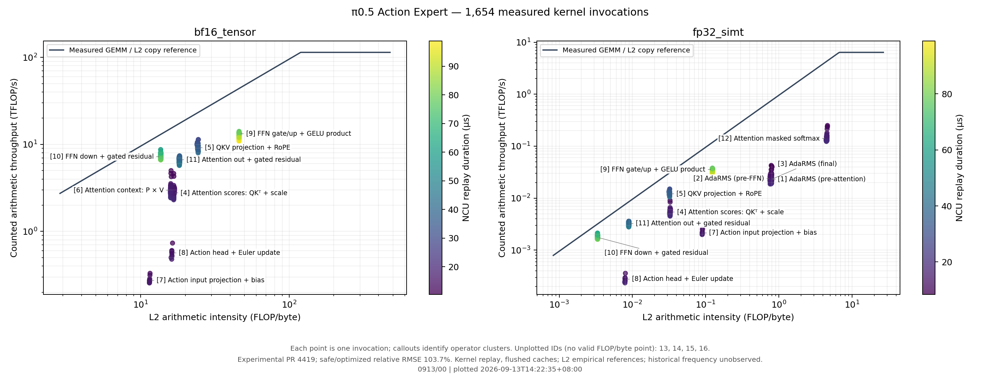

# 0913/00 — 完整 Action Expert roofline，算子标注版

**范围更正：本目录使用历史缺失图像的负载；提供的三路图像均被 mask，实际前缀是 150 个语言／状态 token。新任务按用户要求继续测量未数值验证的 PR，但使用匹配配置的三路图像输入。旧缓存对照 01/02 已取消，未产生新的 NCU 数据。**

本次只重画历史采集数据。原采集：2026-09-13 13:08:14–13:50:29 +08:00；
本次绘图时间见图下方及 `*.plot.json`。包含 1,654 次 launch、16 类算子；
数据来源及 SHA256 在 `source.json`，原始 NCU 报告保留在 [原结果目录](../../thor_pi05_20260913/)。

图内编号对应下表；调用图的引线指向该算子簇中的真实点，未移动任何测量点。
13–16 只有整数／搬运操作，当前两个精度域的浮点计数为零，因此保留 timing 和映射，不伪造 roofline 点。

| ID | 算子含义 | Kernel / 调用位置 | 出现的面板 |
| --- | --- | --- | --- |
| 1 | Attention 前的 AdaRMS | `_adarms_norm_kernel`, line 1854 | FP32 |
| 2 | FFN 前的 AdaRMS | `_adarms_norm_kernel`, line 1945 | FP32 |
| 3 | 最终输出前的 AdaRMS | `_adarms_norm_kernel`, line 1989 | FP32 |
| 4 | Attention 分数：QKᵀ 与缩放 | `_matmul_abt_scale`, line 1899 | BF16、FP32 |
| 5 | QKV 投影与 RoPE | `_matmul_rope_qkv`, line 1863 | BF16、FP32 |
| 6 | Attention 加权汇总：P × V，P 为 softmax 概率 | `_matmul_small`, line 1921 | BF16 |
| 7 | Action 输入投影与 bias | `_matmul_small_bias`, line 1839 | BF16、FP32 |
| 8 | Action 输出投影、bias 与 Euler 更新 | `_matmul_small_bias_res`, line 1998 | BF16、FP32 |
| 9 | FFN gate/up 双投影、GELU 与逐元素乘积 | `_matmul_small_gate`, line 1954 | BF16、FP32 |
| 10 | FFN down 投影与门控残差 | `_matmul_small_res_gate_ffn_down`, line 1971 | BF16、FP32 |
| 11 | Attention 输出投影与门控残差 | `_matmul_small_res_gate_oproj`, line 1932 | BF16、FP32 |
| 12 | Prefix/suffix mask 与 softmax | `_softmax_prefix_suffix_mask_vector`, line 1911 | FP32 |
| 13 | 框架整数拷贝 | `unrolled_elementwise_kernel`, integer copy | 无点：计入的 FLOPs 为 0 |
| 14 | 框架浮点拷贝 | `unrolled_elementwise_kernel`, float copy | 无点：计入的 FLOPs 为 0 |
| 15 | 框架整数填充 | `vectorized_elementwise_kernel`, `FillFunctor<int>` | 无点：计入的 FLOPs 为 0 |
| 16 | 框架 BF16 转换 | `vectorized_elementwise_kernel`, `bfloat16_copy_kernel_cuda` | 无点：计入的 FLOPs 为 0 |

参考线是实测大型 GEMM／L2 copy 的经验值；当前图仅使用 L2 流量。
点低于这条线不等于 L2 带宽饱和，也不能直接归因于 vLLM。
参见 [0913/03 原因分析](../03/)。

采用实验性 PR 4419，safe/optimized 相对 RMSE 仍为 103.7%，数值等价尚未验证。
