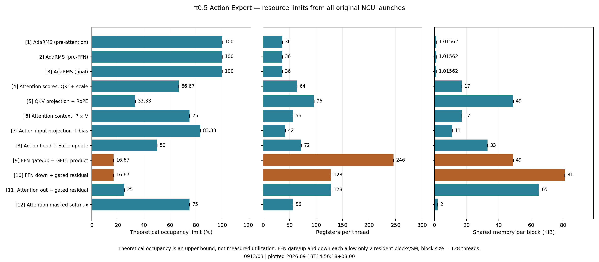

# 0913/03 — 为什么点低于 L2 roofline

**范围更正：本目录使用历史缺失图像的负载；提供的三路图像均被 mask，实际前缀是 150 个语言／状态 token。新任务按用户要求继续测量未数值验证的 PR，但使用匹配配置的三路图像输入。旧缓存对照 01/02 已取消，未产生新的 NCU 数据。**

目前可确认：坐标计算正确，原图是一张 L2 投影图。低于参考线不能直接区分
L1、L2、DRAM、并行度不足或指令依赖。缓存对照已取消，下面先记录原始报告已有的证据。

## 原始报告中的资源限制

| 算子 | 原 NCU 耗时占比 | 寄存器/线程 | 共享内存/block | 寄存器允许 blocks/SM | 共享内存允许 blocks/SM | 理论 occupancy |
|---|---:|---:|---:|---:|---:|---:|
| [9] FFN gate/up + GELU | 26.09% | 246 | 49 KiB | 2 | 2 | 16.67% |
| [10] FFN down + residual | 23.02% | 128 | 81 KiB | 4 | 2 | 16.67% |
| [11] attention out + residual | 12.70% | 128 | 65 KiB | 4 | 3 | 25.00% |
| [5] QKV + RoPE | 11.27% | 96 | 49 KiB | 5 | 4 | 33.33% |

这些值来自 NCU 的 launch / occupancy-limit 指标，并在全部 1,650 个 Triton
launch 上核对范围，详见 `launch_limits.csv`。理论 occupancy 是能同时驻留的 warp
上限，**不是**实测计算利用率，也不能据此声称有 6 倍提速空间。

FFN 两个融合核都只有 64 blocks，Thor 有 20 SM；原报告为 1.6 waves/SM。
低驻留并行度会削弱隐藏指令和访存延迟的能力，需要与实际 stall 指标结合判断。
Action head 仅 8 blocks，甚至无法同时覆盖 20 SM；AdaRMS 仅 50 blocks。
小 kernel 不应拿大型 8192 GEMM 的持续吞吐来要求逐点贴线。

## 图本身说明什么

当前横轴为 `FLOPs / L2 bytes`，纵轴为 `FLOPs / time`。
在斜线段，点到参考线的比例就是 `实测 L2 bytes/time ÷ 954.716 GB/s`。
例如原始 FFN gate/up 是 278.88 GB/s（29.21%），FFN down 是 532.78 GB/s（55.81%）。
这个比例只说明未达到所选 L2 copy 参考速率，不代表真正卡在 L2。

BF16 和 FP32 面板统计同一融合 kernel 中各自的算术量，分母都使用整个 kernel 的时间；
其中还有 SFU、归约、同步和搬运，不能要求两个面板同时贴近纯 GEMM 的线。
Tensor 计数是执行的运算，包含 tile padding，不等同于全部有效模型 FLOPs。

原采集使用 NCU kernel replay + cache-control all，会清空缓存。
57.699 ms 的 NCU 时间和正常 expert CUDA Graph 的 34.725 ms 条件不同，不能互相替代。

## 已取消的缓存对照计划

- `0913/01`：相同真实权重、输入和形状，第一去噪步，cache-control all。
- `0913/02`：同上，唯一主动变化是 cache-control none。
- 两次都只采前 168 次 launch，即 3 个框架辅助核 + 第 0 步全部 165 个 Triton 核；
  完整模型仍运行 10 个去噪步。结论范围限定为第 0 步，不冒充全模型新测量。
- 额外采集 L1/L2 命中率、吞吐利用率、Tensor 活跃度、实际 occupancy、warp stall、SM 频率。
- Thor 指标清单没有直接 DRAM/FBPA bases。L2 read-miss sectors 仅是出 L2 读请求的代理，
  不能当作 DRAM 实际字节或证明 DRAM 带宽饱和。
- 不清缓存的 kernel replay 仍可能由前一次重放预热；这对照检验缓存敏感性，
  **不等于**保持真实应用缓存状态的 application replay。

所有时间记录在对应 `experiment.json`、`ncu/collection.json` 和 `*.plot.json`。
目前 sysfs 只读观察到 GPC min=max=current=1.575 GHz；我们未修改任何频率设置。
旧报告中“unlocked clocks”的说法不严谨，旧实验仅能确认 NCU 没设置频率，历史系统限频未知。

方法依据：[NVIDIA NCU Profiling Guide](https://docs.nvidia.com/nsight-compute/ProfilingGuide/index.html#cache-control)。
数值限制：实验性 PR 4419 的 safe/optimized 相对 RMSE 仍为 103.7%，尚未完成数值等价验证。
