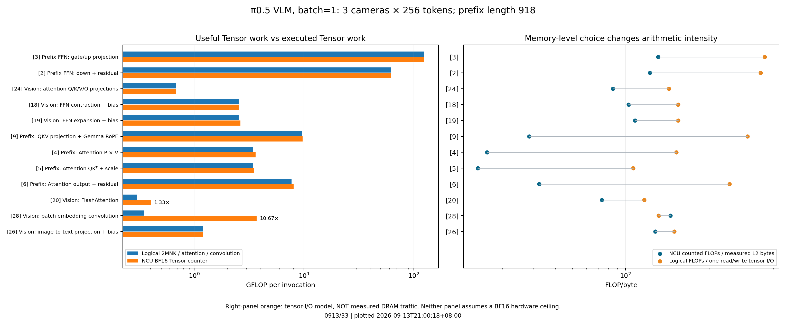
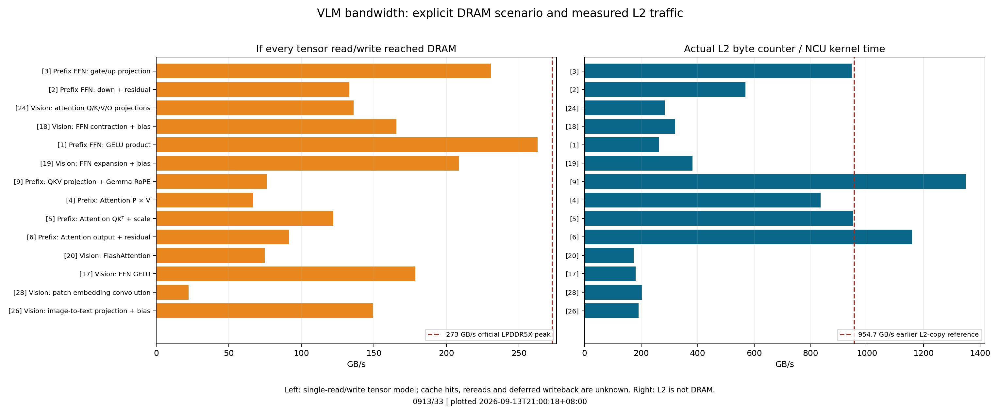

# 0913/33 — VLM 每算子 FLOPs、Thor 带宽与瓶颈分析

**现有证据支持 VLM 内部存在不同类型的瓶颈，不能把整个 VLM 统一判为 DRAM-bound。**
Prefix GELU 的搬运需求接近 DRAM 峰值，前缀 QKV/attention 的 tile 重复读取造成较大的 L2 流量，
大 FFN 投影的工作量和表现则需要单独看。低于参考线、位于参考拐点左侧和实测带宽饱和，是不同层次的判断。

本次只使用 [0913/30 的 VLM 数据](../30/README.md) 和固定源码做 CPU 计算、绘图与检索。
**没有启动 NCU、模型推理、安装或新的 GPU 校准。28/29 仍取消。**
32 是第一版图表，33 调整图例位置和计数倍率标注；两版数值表完全相同，旧图保留。

## 官方带宽与图中的带宽不是同一个层级

只读硬件型号确认为 NVIDIA Jetson AGX Thor Developer Kit。NVIDIA 官方规格为
**128 GB、256-bit LPDDR5X，273 GB/s**；这是共享片外内存的峰值带宽，不是 L2 带宽，也不是当前负载保证能达到的带宽。
[官方 Jetson Thor 规格](https://www.nvidia.com/en-us/autonomous-machines/embedded-systems/jetson-thor/)

原 roofline 用 `lts__t_bytes.sum`，配的 **954.716 GB/s** 是此前的 L2 copy 微基准。
不能把斜线直接换成 273 GB/s 而保留横轴 `F/L2_bytes`。
原参考 BF16=114.088 TFLOP/s 也不是硬件峰值：本轮算子已经实测到 144.903 TFLOP/s。
官网宣传的 2070 是 **FP4 sparse**，不能直接用于本模型的 **BF16 dense** roofline。
本分析不以未验证的 BF16 峰值强行给每个算子贴二元标签。
[NCU roofline 定义](https://docs.nvidia.com/nsight-compute/ProfilingGuide/index.html#roofline-charts)

## FLOPs 的估算方法与结果

- **FLOPs 是运算次数**；**FLOP/s 是吞吐量**，后者用前者除以时间。
- GEMM `A[M,K] @ W[K,N]`：`F_tensor = 2*M*K*N`，FMA=2。
- BF16 矩阵每个元素 2 字节；假设每个逻辑张量只读/写一次，则 `B_once = 2*(M*K + K*N + M*N)`。
  bias、残差、RoPE 等额外张量另加，融合 attention 不凭空加入一个落地的 score 矩阵。
- `B_once` 是张量 I/O 模型，**不是 DRAM 实测字节数，也不是一般情况下严格的 DRAM 下界**。
  缓存命中、重复读取、写回时机和对齐都会改变 DRAM 流量。
- GELU、RMSNorm、softmax 等另列标量 add/mul 估算；exp/tanh/sin/cos/rsqrt、除法及比较列为特殊运算。
  LayerNorm 的 Welford 按逻辑归约合并估算，不能期待与编译后的指令数完全相等。
- 所有 37 组的公式、形状、理论/NCU FLOPs、FLOP/s、L2 带宽、I/O 假设和时长都在下面的表中。

融合 GEMM 在 FP32 面板上的点只计其中的标量工作，却使用整个 kernel 的时间。它很低并不表示这个 GEMM 的 Tensor Core 同样空闲；不能把两个精度面板的点当成互相独立的算子。

[完整 37 组数值表](operator_table.md) · [每组形状与公式](formulas.md) ·
[完整 CSV（含 FLOP/s 和带宽）](operator_costs.csv) · [计算脚本](../../../../profiling/vlm_costs.py)

模型本次有效配置：batch=1，三个相机，每个视觉 encoder 的 token 数 **S=256**、隐藏维度 **1152**、
FFN **4304**、**16 heads × 72**；语言前缀 **L=918**、隐藏维度 **2048**、FFN **16384**、8 Q heads 与 1 KV head。
每个相机独立编码，三路相机没有合成 batch=3。
文字 embedding 实际处理 padding 后的 200 个位置，其中 150 个有效；拼接先产生 968 个位置，
前缀 encoder 截取 918 个有效位置。这个区别已在小算子估算中保留。

**逻辑 Tensor 运算合计 4.224 TFLOPs，NCU 为 4.289 TFLOPs，相差 +1.55%。**
这主要是有效工作量和执行工作量的口径区别；逐组差异可以很大，不能只看总数。
例如视觉 FlashAttention 有效 head_dim=72，而 kernel trait=96，Tensor 计数恰好是逻辑值的 **4/3**。
patch convolution 的比值是 **10.667**，等价于通道从 3 补至 32 的倍率；这是根据计数与形状得到的解释，
尚未独立核实 cuDNN 内部布局。该卷积只有 **0.36%** 的 NCU 耗时，不能据此解释整个 VLM 的性能。



[PDF](tensor_flops_and_intensity.pdf)。左图比较有效 Tensor 运算和硬件执行计数；
右图分别使用实测 L2 字节和一次读写张量模型，分子也明确区分 executed / logical work。
因此右图的距离主要体现缓存层级与重用，卷积等 padding 很大的 kernel 还受到分子口径影响。

## 能从哪些算子看出原因

**[1] Prefix FFN GELU product：最明确的 DRAM 带宽压力候选。**

输入 gate 和 up 各 `918×16384` 个 BF16 元素，输出同样大小：
`B_once = 6×918×16384 = 90,243,072 bytes`。
NCU 平均耗时 **343.563 μs**，其等效 I/O 速率为 **262.668 GB/s**，约规格峰值的 **96.2%**。
实测 L2 字节也只比这一模型多约 **0.14%**；按 273 GB/s 搬完这些数据需 **330.561 μs**。
输入已超过 32 MiB L2，且此次 NCU 每次重放清缓存，因此与带宽压力较大的解释一致。
但实际 DRAM 字节仍未采集，dirty line 写回可能跨越 kernel 边界；96.2% 不能写成实测 DRAM 利用率。
如果输出暂留 L2、只把两份输入计入 DRAM，则需求降为约 **175.11 GB/s**；因此 263 GB/s 只能作为“全部读写到 DRAM”的情景，不能仅凭此认定 DRAM 已打满。它的 NCU 耗时占 **6.89%**，不是整 VLM 的全部。

**[9] Prefix QKV + RoPE：L2 层级的重复流量解释了横坐标为何靠左。**

有效 GEMM 是 `[918,2048] @ [2048,2560]`，每次约 **9.626 GFLOPs** 的 Tensor 运算。
全部唯一权重只有 **10.486 MB**；连同输入、输出和 RoPE 张量，一次读写模型约 **19.416 MB**。
但 kernel 每个 row tile 仅有 **32 行**，共 `ceil(918/32)=29` 份 row tile、10 个 head tile。
权重会按 row tile 重复请求：`10.486 MB × 29 = 304.087 MB`；
再加按 head 重复取输入、RoPE 和输出，源码显式访问模型为 **350.619 MB**，
与实际 **344.331 MB L2/次** 相差约 **1.83%**。
这不是严格的缓存模拟，L1 命中和 sector 取整会造成差异。

于是 `AI_L2 = 9.731 GF / 344.331 MB = 28.26 FLOP/byte`；
一次读写张量模型为约 **495.77 FLOP/byte**。低 L2 AI 与整个算子缺乏权重复用不是一回事：
多个 tile 可以反复从 L2 取同一权重，而无需每次访问 DRAM。
本组实测 L2 带宽 **1,349.07 GB/s**，已经超过旧 copy 参考，说明旧参考并不是有效上界。
它是需要关注 tile/L1/shared-memory 重用和 L2 供数的候选，**仍不能仅凭这个速率断言 L2 饱和**。

**[3]/[2] Prefix FFN gate/up 与 down：计算量很大，不能按散点数量忽略。**

这两个点承担 **74.38% 的逻辑 Tensor FLOPs** 和 **33.03% 的 NCU 耗时**。
它们的 L2 AI 分别为 **153.38 / 137.75**，已经位于旧参考拐点约 **119.50 FLOP/byte** 的右边。
因此原图本身就不支持“VLM 的所有大算子都在 memory-bound 区域”。

Gate/up 的 `M=918,K=2048,N=32768`，计算量 **123.212 GFLOPs/次**；
一次读写 **198.140 MB**、NCU 时间 **859.569 μs**，等效 I/O **230.511 GB/s**；
对应规格带宽搬运时间 **725.787 μs**。它同时做大量计算并产生较高搬运需求，
以规格带宽和这个 I/O 模型为准，DRAM/计算转折所需的 dense Tensor 吞吐约 **169.763 TFLOP/s**。
实际有效计算吞吐约 **143.34 TFLOP/s**（计入 padding 后 NCU 为 **144.90**），
当前缺少同条件的可靠 dense BF16 上界，不能把它直接定为 DRAM 或 compute 饱和。

Down 的等效 I/O 只有 **133.072 GB/s**，远低于 273 GB/s；虽然大权重同样需要搬运，
“带宽已经打满”的解释并未得到支持。两者权重分别为 **128 MiB / 64 MiB**，都超过 L2，
但容量超过缓存不等于所有时间都被 DRAM 带宽限制。

**视觉线性层：token 矩阵大小，而不是请求 batch 数，决定权重重用。**

每相机 GEMM 的 `M=256`。以 `[256,1152] @ [1152,1152]` 为例，
一次读写 AI 约 **177.12 FLOP/byte**，L2 计数得到 **84.92**；
NCU 吞吐 **24.10 TFLOP/s**，一次读写等效带宽约 **136.09 GB/s**。
这不具备直接宣布 DRAM 饱和的证据。小 tile、有限并行度、重用方式和执行/访存延迟均可能参与，
需要相应指标或受控实验才能进一步区分。



[PDF](bandwidth_scenarios.pdf)。左图是明确假设下的等效 DRAM 需求，右图才是 NCU 实测 L2 流量/时间。
所有 37 组的详细数字见 [CSV](operator_costs.csv)。

## 这次能下的结论与边界

1. VLM 不是单 token decode。batch=1 仍有 M=256/918 的 token 维度；应逐算子分析。
2. 逐元素 GELU 有明显带宽压力迹象；prefix QKV/attention 的 L2 重复流量也有明确源码依据。
3. 不能仅用点数判定整体瓶颈；两个大 FFN 点占了四分之三的 Tensor 工作量。
4. 数据来自 **kernel replay + cache-control=all**。NCU 会清空 GPU 缓存，所以它不保留原始前后算子间缓存复用。
   84.741 ms 是重放时间之和；实际 VLM graph p50 为 69.054 ms。不能把整个差值归因于缓存，重放和执行方式也有差别。
   [NCU cache-control 说明](https://docs.nvidia.com/nsight-compute/ProfilingGuide/index.html#cache-control)
5. 没有 DRAM byte counter、实际 DRAM 带宽饱和率、L1 命中等证据，本轮不会把候选原因写成已证明的硬件瓶颈。
   所有已取消的采集仍保持停止。

可优先关注 Prefix GELU 与 FFN 的融合机会，以及 QKV/attention 的 tile 和缓存重用，
但本轮没有修改框架或实施这些优化。

## 复现与验证

`operator_costs.csv` 每行对应 0913/30 图中的一个 ID。
`formulas.md` 列全部形状和计数公式；`validation.json` 检查独立的全模型分项计算量、
已知 padding 倍率和 32/33 数值一致性。`sources.json` 记录官方链接、访问时间及本地源码 SHA256。
公式固定用于本次 37 组，不能未经核对套到别的形状或框架版本。

```bash
source scripts/cache_env.sh
python3 -m profiling.experiments --purpose 'VLM FLOPs 与带宽分析重画'
# 将 NEW_RESULT 替换成新分配的目录，保留所有历史图。
python3 -m profiling.vlm_costs --output NEW_RESULT
```
