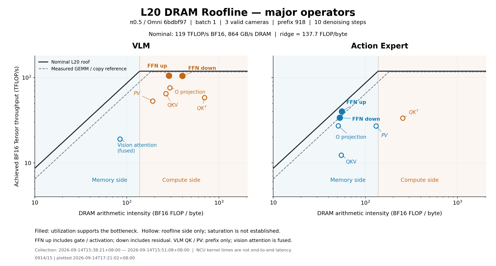

# L20 大算子 DRAM Roofline — 0914/15

采集：2026-09-14T15:38:21+08:00 至 2026-09-14T15:51:08+08:00（Asia/Hong_Kong）；Slurm 1506597。
绘图：0914/15 | plotted 2026-09-14T17:21:02+08:00。本组对应的完整采集依据见 [capture/](capture/)，语义分组见 [mapping.csv](mapping.csv)。

π0.5 / Omni 6bdbf97，真实 pi05_base 权重，BF16，batch=1，3 路有效合成相机输入，prefix=918，10 步去噪。

**FFN up/down 分开后：VLM 两者均有 compute-bound 证据**，Tensor active 分别为 89.6% / 89.1%；**Action Expert 两者均有 DRAM memory-bound 证据**，DRAM 利用率为 83.7% / 74.3%。
QK、PV 等其余点需要区分模型分类和饱和证据。例如 Expert QK 位于 compute side，但 Tensor active 仅约 30%；Expert PV 位于 memory side，但 DRAM 利用率约 24%。本次数据不支持将这些点宣称为已证实的计算/DRAM 带宽饱和。

## 算子边界

- QKV：Q/K/V 投影，保留已融合的 RoPE/bias；O projection：attention 输出投影及已融合残差。
- FFN up：gate/up 升维 + 激活/乘积，含独立的 prefix GELU kernel；FFN down：降维 + 已融合残差。up 与 down 分开。
- VLM 中 QK 和 PV 指 prefix Transformer。视觉编码器使用 FlashAttention，QK、softmax、PV 与 split-KV combine 合在 Vision attention，无法独立分配其实测 DRAM/时间。
- VLM 的投影/FFN 合并视觉与 prefix 的同类操作；重复层、相机、去噪步聚合，保留每个成员的 mapping.csv。

FFN 的规模差异：Expert 的升维输入为 [50,1024]、gate/up 权重各为 [1024,4096]，down 输入为 [50,4096]；VLM prefix 为 918 tokens，视觉每路为 256 tokens。较小 token 数降低权重复用，这是 Expert FFN 算术强度更低的结构性原因。实际 AI 仍用硬件 FLOP/DRAM 计数计算，包含实现中的 padding/recomputation。

## 证据与判定

AI = ΣBF16 FLOPs / ΣDRAM bytes；性能 = ΣBF16 FLOPs / ΣNCU kernel time；每个 kernel 的时间/流量只算一次。
标称 roof 使用 BF16 119 TFLOP/s、DRAM 864 GB/s，拐点 137.73 FLOP/byte。[HPE L20 规格](https://www.hpe.com/es/es/collaterals/collateral.c04123180.html)
虚线是本次作业内的实际 GEMM / copy 参考：BF16 116.80 TFLOP/s，DRAM 647.67 GB/s；经验参考不是硬上限。
roofline side 由两项理想下界比较：t_compute = F/P_peak；t_DRAM = B/BW_peak。此分类描述该模型中的较紧约束；低利用率时不等于硬件已饱和。
实心点要求：compute side 且 Tensor 管线 active ≥75%，或 memory side 且 DRAM utilization ≥70%。这是明确的报告筛选标准，不能代替频率/工作量扰动的因果实验。
利用率是各 kernel 指标按 NCU 时间加权后的均值，不是整段并发运行的硬件利用率。SM throughput 可能包含非 Tensor 管线，L2 throughput 也不等同 DRAM 带宽。
计数器验证：8192³ dense BF16 GEMM 的计数严格等于 2×8192³ FLOPs，达到 116.94 TFLOP/s；Tensor active 98.52%，而 BF16 ops 原始 peak 百分比只有 49.26%。后者的分母与 dense 路径上限不一致，本报告保留原始值但不把它当作 dense 计算利用率。
Roofline 与利用率解释参考 [NVIDIA Nsight Compute Profiling Guide](https://docs.nvidia.com/nsight-compute/ProfilingGuide/#roofline-charts)。

| 模块 | 算子 | AI FLOP/B | TFLOP/s | DRAM GB/s | DRAM % | Tensor active % | L2 % | Roofline side | 证据判定 |
|---|---|---:|---:|---:|---:|---:|---:|---|---|
| vlm | QKV | 265.0 | 64.76 | 244.4 | 28.4 | 55.9 | 36.7 | compute | compute-side; saturation not established |
| vlm | QK | 696.4 | 58.27 | 83.7 | 9.7 | 50.6 | 68.7 | compute | compute-side; saturation not established |
| vlm | PV | 190.3 | 53.22 | 279.7 | 32.4 | 52.4 | 56.2 | compute | compute-side; saturation not established |
| vlm | O projection | 293.4 | 76.16 | 259.6 | 30.1 | 66.1 | 40.1 | compute | compute-side; saturation not established |
| vlm | FFN up | 286.0 | 105.65 | 369.3 | 42.8 | 89.6 | 43.8 | compute | compute-bound supported |
| vlm | FFN down | 399.8 | 104.83 | 262.2 | 30.4 | 89.1 | 42.2 | compute | compute-bound supported |
| vlm | Vision attention | 84.0 | 19.02 | 226.3 | 26.4 | 16.3 | 16.1 | memory | memory-side; saturation not established |
| action_expert | QKV | 55.0 | 12.36 | 224.9 | 26.1 | 10.4 | 7.5 | memory | memory-side; saturation not established |
| action_expert | QK | 255.1 | 33.57 | 131.6 | 15.4 | 29.6 | 38.7 | compute | compute-side; saturation not established |
| action_expert | PV | 131.1 | 27.07 | 206.4 | 24.0 | 23.7 | 33.6 | memory | memory-side; saturation not established |
| action_expert | O projection | 50.9 | 27.26 | 535.2 | 62.3 | 23.7 | 26.3 | memory | memory-side; saturation not established |
| action_expert | FFN up | 55.7 | 40.20 | 721.2 | 83.7 | 34.4 | 20.7 | memory | DRAM-bound supported |
| action_expert | FFN down | 52.9 | 33.83 | 639.1 | 74.3 | 29.6 | 42.7 | memory | DRAM-bound supported |

## 覆盖与复现

所有测量值来自本次完整采集；与旧语义映射逐调用核对 kernel 名、顺序、NVTX、grid、block，模型/输入/动作及冻结 launch 配置均一致。
附表保留 Softmax、Norm/residual、Action IO 和 Other；它们的 BF16、FP32 分开统计，不把归一化/softmax 的 FP32 操作放到 BF16 计算 roof 上。
| 模块 | 总 kernel 数 | 主图 kernel 数 | 主图 NCU 时间覆盖 | 主图 BF16 FLOP 覆盖 |
|---|---:|---:|---:|---:|
| vlm | 1015 | 768 | 95.39% | 99.917% |
| action_expert | 1654 | 1080 | 88.80% | 99.974% |

其余操作仅附表，避免主图过细；FP32 指 add/mul/2×FMA，未计超越函数和整数指令，不能据此单独证明 softmax/norm 的算力瓶颈。
| 模块 | 附属操作 | NCU 合计 ms | BF16 GFLOP | FP32 GFLOP | DRAM GB/s | DRAM % | SM % |
|---|---|---:|---:|---:|---:|---:|---:|
| vlm | Softmax | 0.689 | 0.000 | 0.610 | 766.8 | 89.0 | 19.8 |
| vlm | Norm / residual | 1.274 | 0.000 | 2.582 | 412.6 | 48.1 | 16.6 |
| vlm | Other | 0.300 | 3.624 | 0.012 | 182.2 | 21.2 | 29.6 |
| action_expert | Softmax | 0.989 | 0.000 | 0.344 | 312.4 | 36.5 | 7.2 |
| action_expert | Norm / residual | 1.068 | 0.000 | 0.133 | 42.6 | 5.0 | 1.6 |
| action_expert | Action IO | 0.064 | 0.126 | 0.000 | 46.0 | 5.4 | 2.3 |
| action_expert | Other | 0.011 | 0.000 | 0.000 | 8.7 | 1.0 | 0.1 |

NCU application replay、cache-control=all、未锁频，按 kernel 采集会改变缓存及调度条件；这里的流量/时间用于算子 roofline，不代表生产缓存状态。真实模块及 VLA 时长见 [独立基线](capture/baseline/full_scopes.json)，不能由 kernel 时间求和替代。
范围含图像编码、文字 embedding、prefix Transformer、Expert 输入投影/10步解码/动作头及更新；预处理、tokenization、D2H 与静态 timestep/AdaRMS 条件准备在范围外。当前框架的既有数值差异不在本任务修复，不声称数值等价加速。

[PDF](major_operators.pdf) · [全部大算子 CSV](operators.csv) · [逐 kernel 证据](kernels.csv) · [归组映射](mapping.csv) · [来源及校验](summary.json)

## 发布与复现

当前发布保留本图的原始 PNG/PDF 和全部测量值；仅整理说明文档及相对路径。原始采集时间与图内绘图时间保持不变。

[采集依据](capture/) · [原始 NCU 数据](capture/ncu/raw.csv.gz) · [Slurm 脚本](capture/run.slurm) · [采集代码](capture/harness/profiling/) · [发布清单与 SHA256](publication.json) · [重绘说明](../../../../docs/reproduce.md)
