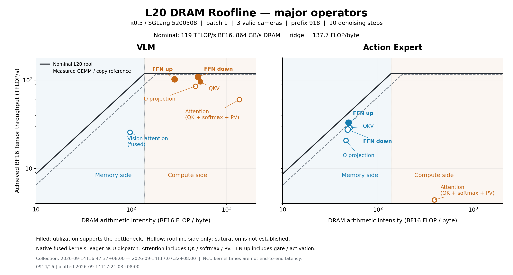

# SGLang π0.5 L20 DRAM Roofline — 0914/16

采集：2026-09-14T16:47:37+08:00 至 2026-09-14T17:07:32+08:00；Slurm 1506879。
绘图：0914/16 | plotted 2026-09-14T17:21:03+08:00。

SGLang 提交 5200508b0fd25733752c2c5e3af5539508023c27；原生优化 QKV、gate/up、融合 attention 和 SigLIP。
同一 lerobot/pi05_base b211f3d checkpoint，BF16 主干，FP32 norm/动作头；batch 1、3 路有效 224×224 图像、150 个文本/state tokens、有效 prefix 918、10 步去噪、50×32 动作。图像及噪声由 seed 17 重建，与旧实验相同。
通过原 Omni 预处理代码独立重建，确认预处理后的图像、tokens、masks 与本次 SGLang 输入 SHA256 精确一致；见 [preprocessing_comparison.json](capture/preprocessing_comparison.json)。

## 统计口径

横纵轴为 log10，主刻度为 10、10²、10³：AI=Σ硬件 BF16 FLOPs/ΣDRAM 读写字节；TFLOP/s=ΣBF16 FLOPs/ΣNCU kernel 时间。重复层与去噪步聚合，每个 kernel 只计一次。
QKV、O projection、FFN up/down 在 VLM 中合并视觉和 prefix 同类操作；vision attention 与 prefix attention 分开。
融合 attention 的 QK、softmax、PV 无法独立分配实测 DRAM/时间，因此保留整体点。FFN up 含 gate/up 与激活；down 为降维，独立的残差留在附表。
实线：L20 标称 BF16 119 TFLOP/s、DRAM 864 GB/s；[规格来源](https://www.hpe.com/es/es/collaterals/collateral.c04123180.html)。虚线：本次作业内 GEMM/copy 实测参考，并非硬上限。
实心点：compute side 且 Tensor active≥75%，或 memory side 且 DRAM utilization≥70%。空心点仅表示 roofline 区域，不能据此证明对应资源饱和。这是报告筛选标准，不是因果干预实验。
NCU 使用 application replay、cache-control=all、未锁频。为保留 NVTX 算子标签，使用 eager 调度运行上游融合 kernels；默认 prefix/action CUDA Graph 另行独立计时。图中不是生产缓存状态下的整体性能。

| 模块 | 算子 | AI FLOP/B | TFLOP/s | DRAM GB/s | DRAM % | Tensor active % | 判定 |
|---|---|---:|---:|---:|---:|---:|---|
| vlm | QKV | 532.74 | 95.92 | 180.1 | 20.9 | 83.4 | compute-bound supported |
| vlm | O projection | 471.98 | 85.70 | 181.6 | 21.1 | 73.9 | compute-side; saturation not established |
| vlm | FFN up | 284.54 | 102.62 | 360.6 | 41.8 | 87.0 | compute-bound supported |
| vlm | FFN down | 500.73 | 109.06 | 217.8 | 25.2 | 92.6 | compute-bound supported |
| vlm | Vision attention | 97.00 | 25.74 | 265.4 | 30.9 | 22.0 | memory-side; saturation not established |
| vlm | Attention (fused) | 1366.60 | 60.42 | 44.2 | 5.1 | 51.1 | compute-side; saturation not established |
| action_expert | QKV | 51.04 | 28.95 | 567.1 | 66.0 | 24.9 | memory-side; saturation not established |
| action_expert | O projection | 46.31 | 20.74 | 447.8 | 52.2 | 17.8 | memory-side; saturation not established |
| action_expert | FFN up | 49.10 | 33.03 | 672.6 | 78.1 | 28.2 | DRAM-bound supported |
| action_expert | FFN down | 48.28 | 27.61 | 571.8 | 66.5 | 23.7 | memory-side; saturation not established |
| action_expert | Attention (fused) | 391.73 | 4.40 | 11.2 | 1.3 | 3.7 | compute-side; saturation not established |

## 独立计时与校验

| 范围 | native graph CUDA event p50 ms | 同步 wall p50 ms |
|---|---:|---:|
| vlm | 48.624 | 48.640 |
| action_expert | 52.056 | 52.076 |
| vla | 100.581 | 100.609 |

Native graph 与 eager 动作最大绝对差：0.0；各 application passes 的输入、模型参数、动作与 NVTX manifest 均精确一致。
GPU 范围不含图像 CPU 预处理、tokenization、初始图像 H2D、结果 D2H 或服务器传输。NCU 时间不能与上述完整范围延迟混用。
本次 SGLang 原生去噪包括时间 MLP 和各层条件投影；旧 Omni 的 GPU scope 在计时前准备静态 timestep/AdaRMS 条件。上表用于记录本次实现，不能直接除以旧时长作为严格框架加速比。
与 Omni 对比存在 PyTorch 2.13/2.11、内核与融合边界差异；当前任务没有验证两个框架数值等价，因此不宣称数值等价加速。
SGLang 将三路相机合批执行 SigLIP，并运行 18 层 prefix attention；原 Omni 的 QK/PV 计数为 17 层（最后一层只需生成 KV）。这些实现差异保留在各自测量中。
FP32 附表只统计 add/mul/2×FMA；未计超越函数、FP64 时间编码或整数运算，不将其与 BF16 FLOPs 混用。

[PDF](major_operators.pdf) · [算子数据](operators.csv) · [逐 kernel](kernels.csv) · [来源、校验与独立时长](summary.json)

## 发布与复现

当前发布保留本图的原始 PNG/PDF 和全部测量值；仅整理说明文档及相对路径。原始采集时间与图内绘图时间保持不变。

[采集依据](capture/) · [原始 NCU 数据](capture/ncu/raw.csv.gz) · [Slurm 脚本](capture/run.slurm) · [采集代码](capture/harness/profiling/) · [发布清单与 SHA256](publication.json) · [重绘说明](../../../../docs/reproduce.md)
