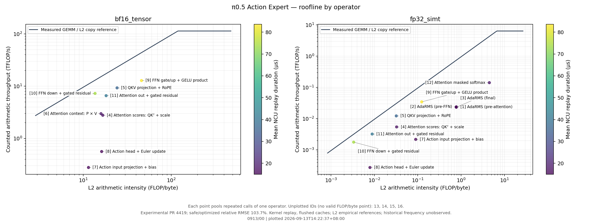
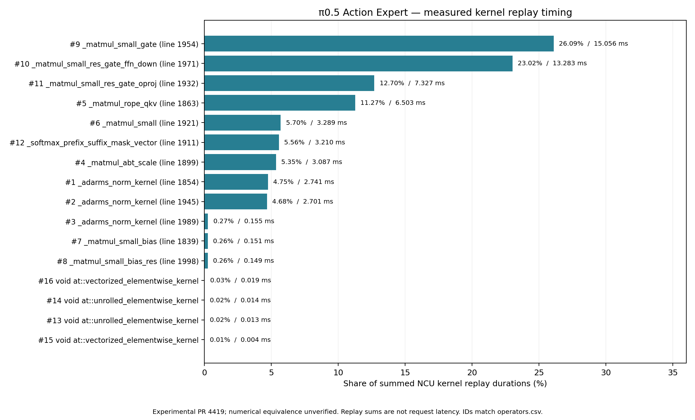
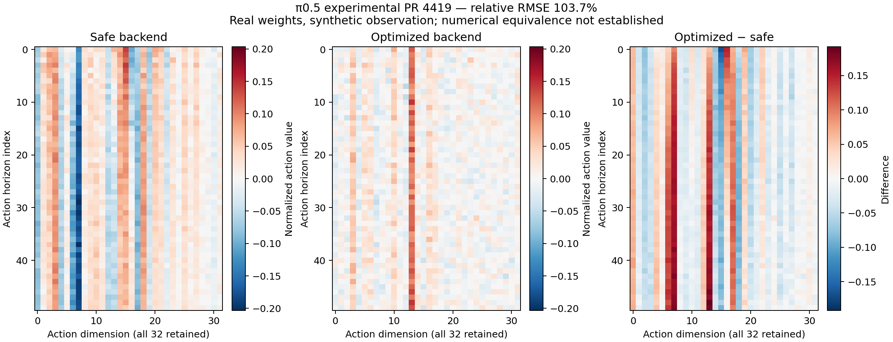

# Thor π0.5 real-weight measurements — 2026-09-13

**更正：历史脚本的短摄像头键名未匹配模型配置，三路输入图像均被 mask。
本目录描述有效前缀为 150 个语言／状态 token 的历史负载，不能代表三摄像头 VLA。
后续三路有效图像的分段 profiling 见 [0913/08](../0913/08/)。**

This is a measurement of the pinned experimental vLLM-Omni PR 4419 implementation.
**Safe/optimized numerical equivalence is not established: relative RMSE is
103.7%. Do not interpret the latency ratio as a validated equivalent-model speedup.**
Action Expert NCU collection and coverage validation are complete. The report
contains 1,654 kernel invocations, grouped into 16 operators/launch sites.

## L2 roofline and measured hotspots

The original figures below are retained. The dated version with direct operator
names is [0913/00](../0913/00/); the interpretation and cache investigation are
recorded in [0913/03](../0913/03/).



Each plotted operator is labelled directly with its ID and semantic name. The
same ID in the two panels refers to the same operator's different arithmetic
domains. The grouped plot pools repeated calls; the invocation plot labels each
operator cluster while preserving every measured point. `operator_legend.csv`
maps IDs and displayed names to the full kernel/launch-site names and plotted
domains. Source roles were checked against pinned PR 4419 `realtime_triton.py`.

| ID | 算子含义 | Kernel / 调用位置 | 出现的面板 |
| --- | --- | --- | --- |
| 1 | Attention 前的 AdaRMS | `_adarms_norm_kernel`, line 1854 | FP32 |
| 2 | FFN 前的 AdaRMS | `_adarms_norm_kernel`, line 1945 | FP32 |
| 3 | 最终输出前的 AdaRMS | `_adarms_norm_kernel`, line 1989 | FP32 |
| 4 | Attention 分数：QKᵀ 与缩放 | `_matmul_abt_scale`, line 1899 | BF16、FP32 |
| 5 | QKV 投影与 RoPE | `_matmul_rope_qkv`, line 1863 | BF16、FP32 |
| 6 | Attention 加权汇总：P × V，P 为 softmax 概率 | `_matmul_small`, line 1921 | BF16 |
| 7 | Action 输入投影与 bias | `_matmul_small_bias`, line 1839 | BF16、FP32 |
| 8 | Action 输出投影、bias 与 Euler 更新 | `_matmul_small_bias_res`, line 1998 | BF16、FP32 |
| 9 | FFN gate/up 双投影、GELU 与逐元素乘积 | `_matmul_small_gate`, line 1954 | BF16、FP32 |
| 10 | FFN down 投影与门控残差 | `_matmul_small_res_gate_ffn_down`, line 1971 | BF16、FP32 |
| 11 | Attention 输出投影与门控残差 | `_matmul_small_res_gate_oproj`, line 1932 | BF16、FP32 |
| 12 | Prefix/suffix mask 与 softmax | `_softmax_prefix_suffix_mask_vector`, line 1911 | FP32 |
| 13 | 框架整数拷贝 | `unrolled_elementwise_kernel`, integer copy | 无点：计入的 FLOPs 为 0 |
| 14 | 框架浮点拷贝 | `unrolled_elementwise_kernel`, float copy | 无点：计入的 FLOPs 为 0 |
| 15 | 框架整数填充 | `vectorized_elementwise_kernel`, `FillFunctor<int>` | 无点：计入的 FLOPs 为 0 |
| 16 | 框架 BF16 转换 | `vectorized_elementwise_kernel`, `bfloat16_copy_kernel_cuda` | 无点：计入的 FLOPs 为 0 |

The numbered points match `operators.csv`. This is an **L2** roofline: the installed
Thor NCU has no DRAM byte counters. BF16 Tensor and FP32 SIMT arithmetic are shown
separately, with each kernel's full duration/traffic in each applicable panel.
Integer and transcendental instructions are not counted as ordinary FLOPs.
Hardware arithmetic includes padded tile work. The 738 precision rows with zero
counted FLOPs stay in the table; they do not become artificial logarithmic points.

| ID | Fused operator | Calls | Mean NCU duration (µs) | NCU time share | BF16 FLOP / L2 byte | BF16 TFLOP/s |
| --- | --- | ---: | ---: | ---: | ---: | ---: |
| 9 | FFN gate/up, GELU and multiply | 180 | 83.642 | 26.09% | 46.031 | 12.837 |
| 10 | FFN down and gated residual | 180 | 73.793 | 23.02% | 13.655 | 7.275 |
| 11 | Attention output projection and gated residual | 180 | 40.703 | 12.70% | 18.241 | 6.595 |
| 5 | QKV projection and RoPE | 180 | 36.127 | 11.27% | 24.284 | 9.288 |

The two FFN kernels account for **49.114%** of NCU replay duration; these four
groups together account for 73.082%. Full timings, including normalization,
softmax, input/output projections and framework kernels, are in `hotspots.csv`.



Summed NCU duration is **57.699 ms**, L2 traffic is **17.822 GB**, counted BF16
Tensor work is **417.155 GFLOP**, and counted FP32 SIMT work is **1.251 GFLOP**.
Duration and traffic are counted once per invocation in these totals.
These are kernel replay measurements with flushed caches, not original request
latency. They must not replace the independent CUDA Graph measurement below.

The empirical references are 114.088 TFLOP/s BF16, 6.375 TFLOP/s FP32 and
954.716 GB/s effective L2 copy bandwidth, from the separately validated
[`compute_counter_validation`](../compute_counter_validation/) run.
NCU clock control was disabled; historical system frequency limits were not
recorded and nvidia-smi reported N/A. This does not establish "unlocked clocks".
The plotted Tensor
points are on the bandwidth branch of this empirical L2 roof and below it;
this alone does not establish a DRAM bottleneck or explain all unused throughput.

Coverage checks pass: all **1,650 Triton launches** exactly match the instrumentation
manifest, with **165 per denoising step**, all **18 layers**, plus four framework
fill/copy/conversion kernels. All six requested metrics are present. The two
exports match by process/device/context/stream/kernel ID and metric values.
`cross_run_consistency.json` also records exact agreement of input noise and
optimized pipeline outputs between the baseline and NCU workload runs.

## Workload and latency

Real `lerobot/pi05_base` weights, revision
`b211f3d44c36b6acfcf7ae94a64e8e96f75a64ba`; BF16 blanket cast, batch 1,
three synthetic 224×224 RGB cameras, zero state, fixed noise/seed 17,
ten denoising steps, output `[50,32]`. Cross-request prefix caches are disabled.
All 813 expected parameter names loaded; no missing parameters.

Each row uses 3 warmups and 20 measurements without NCU. Pipeline time includes
preprocessing, prefix computation, denoising and output copy, excluding service
transport/scheduling. Expert device time excludes prefix and AdaRMS precomputation.

| Measurement | p50 (ms) | p95 (ms) |
| --- | ---: | ---: |
| Safe pipeline wall time | 237.790 | 241.429 |
| Optimized pipeline wall time | 72.456 | 73.762 |
| Optimized expert, CUDA Graph | 34.725 | 34.811 |
| Optimized expert, direct launches | 35.594 | 35.824 |

`benchmark.json` preserves all individual samples, versions and configuration.
`actions.npz` preserves safe/optimized normalized-space actions and input noise.
`numerical_difference.json` is computed from those saved arrays: maximum absolute
error 0.191869, mean absolute error 0.043668, error RMS 0.059375, safe RMS 0.057254.
Expert direct/graph maximum absolute difference was 0.0. This last check only
validates graph replay of the same experimental decoder, not model correctness.
The safe/optimized difference has not been isolated to an individual component.
No external LeRobot oracle or robot task evaluation has been run.



`error_by_dimension.csv` retains all 32 dimensions; no dimensions are dropped
to reduce the reported error. The first two panels share a color scale, while
the difference panel has its own symmetric scale. Reproduce the PNG/PDF and CSV:

```bash
python3 -m profiling.plot_actions results/processed/thor_pi05_20260913/actions.npz \
  --output results/processed/thor_pi05_20260913
```

## Memory and platform

NVIDIA Thor GB10B, compute capability 11.0, shared ARM64 runtime, Torch 2.11.0+cu130,
vLLM 0.22.0, Triton 3.6.0, Transformers 5.8.1. Existing CUDA 13.2 `ptxas`
is used for `sm_110a` JIT. No environment packages were installed on Thor.

Torch peak allocated: 15,544,240,640 bytes (14.48 GiB); peak reserved:
15,730,737,152 bytes. Read-only 10-second samples show process HWM 31.66 GiB
and minimum host available memory 99.11 GiB. RSS and CUDA allocations overlap on
UMA and must not be added. Sampling is not a hard memory bound.
Power/clock queries are retained; historical N/A fields remain unknown. We did not
change clock settings; later sysfs observations are recorded separately in 0913/01.
NCU-phase samples show process HWM 31.72 GiB and minimum host available memory
79.65 GiB. The NCU workload's Torch peak allocated is 15,379,749,888 bytes;
profiler allocations are not fully represented by Torch allocator statistics.

The first startup attempt timed out during NFS weight loading. The completed
retry allowed two hours; loading time is excluded from all latency numbers.

## Reproduce

On Thor, from the project directory, with the shared runtime and downloaded assets:

```bash
bash scripts/thor_python.sh -u -m profiling.bench_pi05 \
  --checkpoint /scratch/xinyaowang/vla-vllm-profiling/assets/pi05_base/b211f3d44c36b6acfcf7ae94a64e8e96f75a64ba \
  --tokenizer /scratch/xinyaowang/vla-vllm-profiling/assets/paligemma_tokenizer \
  --output results/raw/new_baseline --cameras 3 --steps 10 --warmup 3 --iterations 20
```

See the root README for source reconstruction, asset download, NCU commands and
measurement definitions. Use a new output directory for each run.

The exact NCU capture command is in `ncu/collection.json`. Reprocess the published
report exports locally without using a GPU or loading model weights:

```bash
source scripts/cache_env.sh
experiment_dir=$(python3 -m profiling.experiments --purpose 'Replot complete original profile')
python3 -m profiling.roofline results/processed/thor_pi05_20260913/ncu/raw.csv \
  --operators-csv results/processed/thor_pi05_20260913/ncu/operators.csv \
  --contract results/processed/thor_pi05_20260913/metrics.json \
  --ceilings results/processed/compute_counter_validation/ceilings_l2.json \
  --caption 'Experimental PR 4419; safe/optimized relative RMSE 103.7%. Kernel replay, flushed caches; L2 empirical references; historical frequency unobserved.' \
  --output "$experiment_dir"
python3 -m profiling.audit_profile \
  --raw results/processed/thor_pi05_20260913/ncu/raw.csv \
  --annotated results/processed/thor_pi05_20260913/ncu/operators.csv \
  --benchmark results/processed/thor_pi05_20260913/profile_workload.json \
  --contract results/processed/thor_pi05_20260913/metrics.json \
  --output results/processed/thor_pi05_20260913 --plot
```

## Files and provenance

- `ncu/action_expert.ncu-rep`: original 35,045,925-byte report, directly included in Git.
- `ncu/raw.csv`, `ncu/operators.csv`: original raw and NVTX-renamed NCU exports.
- `kernels.csv`: all 1,654 invocations × two precision domains, including zero rows.
- `operators.csv`: 16 groups × two precision domains, pooled by source launch site.
- `operator_legend.csv`: full ID → displayed name → kernel/launch-site mapping.
- `roofline.png/pdf`, `roofline_by_operator.png/pdf`, `hotspots.png/pdf`: measured figures.
- `coverage.json`, `profile_workload.json`: complete manifest and collection audit.
- `benchmark.json`, `actions.npz`, `baseline.log`: independent baseline and numerical observations.
- `run_provenance.json`, `analysis_environment.json`, `metrics.json`: source hashes,
  runtime/analysis versions, selected environment and the counter contract.
- `memory_summary.json`, memory CSVs and power observations: read-only resource records.
- `artifact_sha256.json`: integrity hashes for the published files; regenerated PDFs
  may have different creation metadata while retaining the same measurement data.

Recompute numerical errors from this directory's saved arrays:

```python
import numpy as np
a = np.load("results/processed/thor_pi05_20260913/actions.npz")
d = a["optimized"] - a["safe"]
print("max_abs", np.abs(d).max(), "mean_abs", np.abs(d).mean())
print("relative_rmse", np.sqrt(np.mean(d**2)) / np.sqrt(np.mean(a["safe"]**2)))
```
